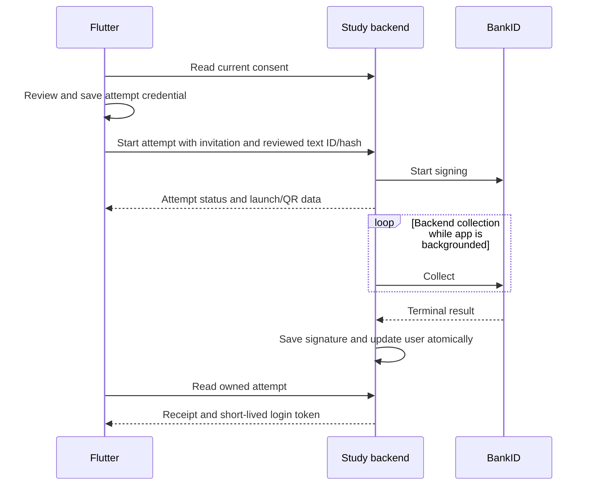

# Study and BankID architecture

This document describes the implemented architecture. The implementation checklist is in [implementation-plan.md](../implementation-plan.md); operating instructions are in [bankid-testing.md](bankid-testing.md).

## Data ownership

There are eight application collections. PocketBase's internal collections are separate.

| Collection | Purpose |
| --- | --- |
| `users` | Participant, optional invitation, protected identity, current consent, and metadata history. |
| `signatures` | Terminal authentication/signing attempts, original provider responses, exact signing payload, and application acceptance outcome. |
| `consent_texts` | Immutable published text, version and hash; one current version per study. |
| `answers` | Participant answers and questionnaire reference. |
| `dataUploads` | Upload records referring to compressed files. |
| `questionnaires` | Questionnaire definitions. |
| `questions` | Questions and their dependencies/options. |
| `questionOptions` | Question options. |

Issuing an invitation creates an inactive user or replaces the invitation on an existing inactive user. Signing activates that same record. An accepted identity is unique within its study and BankID environment. Invitation and identity secrets are hidden from participant responses; evidence is encrypted with a separately configured keyring.

A signature's provider status and application outcome are separate: a completed BankID operation can be rejected for a wrong signer, changed consent, expired invitation, invalid evidence, or unacceptable risk. Signing and authentication attempts both produce terminal records. Unknown outcomes remain unknown. Withdrawal timestamps belong to the affected acceptance; later signing does not erase them.

## Attempt lifecycle

A returning participant starts authentication without an invitation. If current consent is missing, the accepted authentication attempt authorizes a new signing attempt after review. Authentication alone never authorizes uploads.

The study module owns bounded, expiring attempts in memory. Its public interface is start, status, cancel, and return. The BankID HTTP client remains the adapter for provider requests. Tests cross these interfaces using a fake provider and real temporary PocketBase databases.

The server polls independently of app lifecycle. Per-attempt locking serializes status, cancellation, and finalization. A terminal response stays in memory if saving fails; persistence is retried without asking BankID for the result again. Access is granted only after evidence and participant state commit together.

## Restart and session behavior

Attempts last 20 minutes, followed by a 10-minute result-delivery window. The process holds at most 1,024 attempts and collects with bounded concurrency. Expired terminal attempts are removed. Unsaved terminal results remain available for persistence retry and count toward the limit.

Only one backend process/replica is supported. A backend restart loses pending attempts and their temporary credentials. Flutter receives an explicit expired-attempt response, clears its local reference, and offers a new start. If acceptance already committed, returning BankID login recovers access. A crash before saving a response can leave no terminal audit record; no durable recovery is claimed.

Flutter stores only an attempt ID, secret, and expiry in secure storage. It retrieves the result from the backend after app relaunch. BankID return links validate their nonce and cannot establish acceptance by themselves.

Application sessions use non-refreshable PocketBase tokens with a two-hour absolute lifetime from the BankID verification. No separate session registry exists. Logout rotates the user's token key and signs out all devices. Every protected write checks current consent, including withdrawal and newly published versions.

## Permanent cutover

The backend and Flutter client change together. Fresh installations create the target collections directly. The separate offline converter reads the previous format once, preserves participant IDs and questionnaire/upload relations, re-encrypts evidence under its retained signature ID, converts flat upload files, invalidates old sessions, and removes retired collections in the output copy.

The request-serving backend has no previous-format endpoints, dual writes, or fallback readers. Changes to the target schema use new forward migrations from this baseline.
